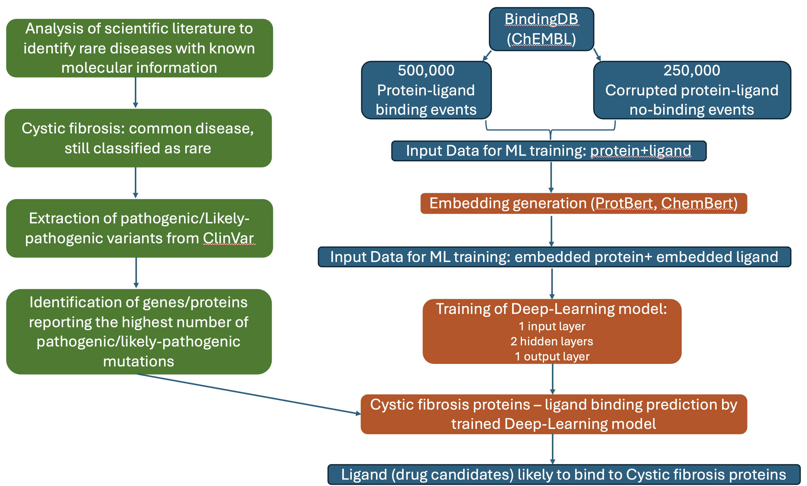

# Team4_AI_Drug_Targets_Rare_Diseases: RARExDrug

# Docker Image to run the RARExDrug pipeline

This Docker image provides an environment for running protein-ligand interaction prediction using pretrained models such as **ProtBERT** and **ChemBERTa** with PyTorch.

## 🐳 Image Info

- **Base Image**: `python:3.10-slim`
- **Includes**:
  - PyTorch
  - HuggingFace Transformers
  - RDKit
  - pandas, scikit-learn, tqdm, and other scientific packages
- **Supports**: CPU only

## 📦 Pull the Image

```bash
docker pull fedecargo/protchem:cpu
```

## 🏗️ Run RARExDrug pipeline through Snakemake 
Requires Singularity installed and configured
```bash
snakemake --use-singularity --cores 4
```

## 👥 Team members
David Liu, CareDx, Brisbane California, USA

Federico Rossi, SOPHiA GENETICS, Rolle, Switzerland

John Adedeji, Osun State University, Nigeria

Mukul Sherekar, Georgetown University and x10e, Washington DC, USA

## 🧬 Find a relevant rare-disease for which genetic information are available regarding the existing variants

We will focus on cystic fibrosis that is common among the world populations but still considered rare.
Drug treatment of cystic fibrosis mainly targets the CFTR gene (Cystic Fibrosis Transmembrane Conductance Regulator). Drugs aim to correct the expression expression or function of the defective CFTR protein. The relevance of CFTR for th treatment of cystic fibrosis is also remarked by the number of pathogenic or likely-pathogenic variants hosted on Clinvar (https://www.ncbi.nlm.nih.gov/clinvar) that are linked to this gene. Based on Clinvar, CFTR presents 1102 Pathogenic/Likely-pathogenic variants. These 1102 variants include the following main variant types:
| **Mutation type**    | **Count**                  |
| ----------------- | --------------------------- |
| Deletion | 404 |
| Duplication | 127 |
| Indel | 28 |
| Insertion | 10 |
| Microsatellite | 20 |
| Copy number loss | 1 |
| single nucleotide variant | 504 |


Drugs currently available to treat cystic fibrosis are the following:

| **Drug Class**    | **Target**                  | **Example**                     | **SMILES Structure**                                                                                        |
| ----------------- | --------------------------- | ------------------------------- | ---------------------------------------------------------------------------------------------------         |
| Potentiator       | CFTR gating                 | Ivacaftor                       | <pre> ```CC(C)(C)C1=CC(=C(C=C1NC(=O)C2=CNC3=CC=CC=C3C2=O)O)C(C)(C)C ```</pre>                               |
| Corrector         | CFTR folding/trafficking    | Lumacaftor                      | <pre> ```CC1=C(N=C(C=C1)NC(=O)C2(CC2)C3=CC4=C(C=C3)OC(O4)(F)F)C5=CC(=CC=C5)C(=O)O ```</pre>                 |
|                   | CFTR folding/trafficking    | Tezacaftor                      | <pre> ```CC(C)(CO)C1=CC2=CC(=C(C=C2N1C[C@H](CO)O)F)NC(=O)C3(CC3)C4=CC5=C(C=C4)OC(O5)(F)F ```</pre>          |
| Amplifier         | CFTR expression             | Nesolicaftor (experimental)     | <pre> ```C[C@H](C1=NN=C(O1)C2CC(C2)NC(=O)C3=CC(=NO3)C4=CC=CC=C4)O ```</pre>                                 |
| Readthrough agent | Premature stop codons       | Ataluren                        | <pre> ```C1=CC=C(C(=C1)C2=NC(=NO2)C3=CC(=CC=C3)C(=O)O)F ```</pre>                                           |
| Gene therapy      | CFTR gene                   | CRISPR, mRNA delivery           | <pre> ```N/A ```</pre>                                                                                      |
| ENaC inhibitors   | Sodium channel              | BI 1265162 (investigational)    | <pre> ```CCN1C2=C(C=CC(=C2)OCC(=O)NCCOCP(=O)(C)C)[N+](=C1CNC(=O)C3=NC(=CN=C3N)Cl)CC.OP(=O)(O)[O-] ```</pre> |
| Anti-inflammatory | Neutrophilic inflammation   | Lenabasum                       | <pre> ```CCCCCCC(C)(C)C1=CC(=C2[C@@H]3CC(=CC[C@H]3C(OC2=C1)(C)C)C(=O)O)O ```</pre>                          |
|                   | Neutrophilic inflammation   | Ibuprofen                       | <pre> ```CC(C)CC1=CC=C(C=C1)C(C)C(=O)O ```</pre>                                                            |
| Mucolytics        | Mucus degradation/hydration | Dornase alfa                    | <pre> ```N/A* ```</pre>                                                                                     |
|                   | Mucus degradation/hydration | Hypertonic saline               | <pre> ```N/A  ```</pre>                                                                                     |

**N.B**: N/A- Not applicable, N/A*- Not available

We obtained the chemical structure of Ivacaftor and we plan to obtain the same information for others drugs that targets cystic fibrosis with the aim of comparing the structure of the drugs currently used to treat cystic fibrosis with the ligand that will be identified through our machine learning model.

## 💾 Select a database of protein-ligand interactions to be used as input for the training of the ML model
We selected BindingDB as the database of protein-ligand interactions to be used as input for the training of the ML model (https://www.bindingdb.org/rwd/bind/chemsearch/marvin/Download.jsp). 
BindingDB was selected because:

1. it is provided in several iteration (data extracted from ChEMBL, Patents, Publications) thus allowing to test the quality of distinct source of information or to combine them to obtain better accuracy in the prediction of the ML model;
2. it is freely available for academic use;
3. it contains a number of protein-ligand interaction that is sufficiently high for the training of an ML model (e.g. >500,000 entries available in ChEMBL BindingDB database);
4. it provides ligand in SMILE format and sequences in AA format, which can fit the type of input files needed for the training of the ML model.

BindingDB contains examples in which a ligand binds a protein. However, the training of an ML model also requires "negative" examples of interactions where a ligand is not expected to bind the protein. To generate pairs of proteins and ligands expected to not interact, we replaced the 30% of the aminoacid of the protein sequence with some other aminoacid thus leading to a protein that is likely to lack the structural properties that would allow the establishment of a protein-ligand interaction.
   
## 🔗 Find a tool to generate embeddings from the protein sequences
SMILE representation of ligands and protein sequences cannot be used as input for the training of the ML model as they are, but instead need to be converted into embeddings which are "low-dimensional, learned vector representations of high-dimensional or complex data, where similar inputs are mapped to nearby points in the vector space". To convert SMILE and aminoacid sequences into embeddings, we first considered the tool ProteinBERT (https://github.com/nadavbra/protein_bert). ProteinBERT is able to convert protein SMILE representations into amino acid sequences and we further integrated them with ChemBERTa to effectively encode chemical structures from SMILES representations. This allows the model to be applicable across diverse datasets by relying on amino acid sequences rather than PDB structures. 

## 🤖 Build a first-prototype of the deep learning model using a basic architecture
We built a first prototype of a deep-learning (DL) model that is expected to take the BindingDB dataset as an input and to be used to predict the interaction between known biomarkers of cystic fibrosis and ligands (drugs) that are available in BindingDB. We first considered a simple DL architecture built through the keras Sequential() API as follows:

1. input layer with 3050 nodes and relu activation function
2. first hidden layer with 2000 nodes and relu activation function
3. second hidden layer with 2000 nodes and relu activation function
4. output layer with a single node (1/0 prediction of the model) and sigmoid activation function.

The model was then compiled setting the loss to 'binary_crossentropy', the optimizer to 'adam' and requiring the 'accuracy' metrics to be computed.

The performance of this basic DL architecture will be compared with the performance of models that are already available.

## Flowchart of ML pipeline for Cystic Fibrosis Drug Prediction


